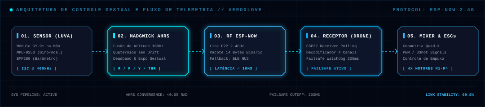

<!-- BANNER ANIMADO AEROGLOVE / PYDRONE -->
<p align="center">
  
</p>

<!-- TECH BADGES MINIMALISTAS E HIGH-TECH -->
<p align="center">
  
  
  
  
  
  
  
</p>

---

## 🧤 Visão Geral do Projeto

O **AeroGlove** é uma luva controladora vestível (*wearable*) desenvolvida em **MicroPython** sobre o microcontrolador **ESP32 / ESP32-S3**, projetada para pilotagem intuitiva de microdrones (**pyDrone**) por meio de **gestos naturais da mão**.

O sistema captura as movimentações do operador através de uma IMU 9-DOF (módulo **GY-91** com **MPU-9250** e barômetro **BMP280**), processa a orientação espacial em tempo real com o algoritmo de fusão **Madgwick AHRS @ 100Hz** e traduz as atitudes angulares da mão em canais de voo RC (*Throttle*, *Roll*, *Pitch*, *Yaw*), transmitindo os comandos por **ESP-NOW** (latência `< 10ms`) ou via **BLE NUS (Nordic UART Service)**.

---

## 📐 Arquitetura do Sistema e Fluxo de Telemetria

Abaixo está o mapeamento visual do processamento contínuo desde o gesto da mão na luva até a atuação dos motores na aeronave:

<p align="center">
  
</p>

### Ciclo de Operação e Processamento de Gestos

1. **Captura do Gesto (Luva / GY-91)**: Leitura dos dados brutos de aceleração linear, velocidade angular e pressão barométrica via barramento I2C a 400kHz.
2. **Fusão de Atitude (Madgwick AHRS)**: O algoritmo calcula quatérnios de rotação contínuos a uma taxa de 100Hz ($\beta = 0.08$), eliminando o drift giroscópico e gerando os ângulos reais de *Roll*, *Pitch* e *Yaw*.
3. **Mapeamento de Comandos RC**:
   - **Inclinação Frontal / Traseira**: Controla o *Pitch* (Avanço / Recuo).
   - **Inclinação Lateral**: Controla o *Roll* (Deslocamento Esquerda / Direita).
   - **Rotação do Punho**: Controla o *Yaw* (Giro no próprio eixo).
   - Aplicação de **Deadband** (zona morta no centro neutro) e curva **Exponencial** para controle suave.
4. **Transmissão Sem Fio**: Empacotamento binário em 14 bytes e envio ultrarrápido via protocolo **ESP-NOW** (ou fallback BLE NUS).
5. **Recepção e Segurança (Drone)**: O receptor decodifica os canais, alimenta o mixer dos 4 motores e mantém ativo o *Watchdog Failsafe* (se ficar sem sinal por $> 200\text{ms}$, os motores são desativados preventivamente).

---

## 🛠️ Materiais e Componentes de Hardware

| Componente | Especificação Recomendada | Função |
| :--- | :--- | :--- |
| **Microcontrolador (MCU)** | ESP32-S3 Dual-Core (ou ESP32 Standard) | Processamento central da luva e do drone |
| **Sensor Inercial (IMU)** | Módulo GY-91 (MPU-9250 + BMP280) | Giroscópio, Acelerômetro, Magnetômetro e Barômetro |
| **Alimentação da Luva** | Bateria LiPo 3.7V (ex.: 500mAh a 1200mAh) | Fonte de alimentação autônoma e portátil |
| **Carregador de Bateria** | Módulo TP4056 com proteção | Carga via porta USB Type-C / Micro-USB |
| **Estrutura Vestível** | Luva esportiva / têxtil + Case impresso em 3D | Fixação ergonômica da eletrônica na mão/punho |
| **Aeronave de Voo Base** | Microdrone Quadcopter (Quad-X) | Plataforma de voo (ex.: base [pyDrone 01Studio](https://github.com/01studio-lab/pyDrone)) |

---

## 🔌 Pinagem do Hardware (Barramento I2C)

Conecte o módulo **GY-91** ao ESP32 conforme o mapeamento padrão:

```
  Módulo GY-91                 ESP32 / ESP32-S3
 ┌──────────────┐             ┌──────────────────┐
 │     VCC      │────────────▶│  3.3V            │
 │     GND      │────────────▶│  GND             │
 │     SDA      │────────────▶│  GPIO 8  (I2C)   │
 │     SCL      │────────────▶│  GPIO 9  (I2C)   │
 └──────────────┘             └──────────────────┘
```

> **Atenção:** Confirme a pinagem e o nível de tensão (3.3V) da sua placa antes de energizar o circuito.

---

## 🚀 Guia de Instalação e Inicialização

### 1. Gravar o Firmware MicroPython no ESP32

Instale o `esptool` via terminal:
```bash
pip install esptool
```

Conecte a placa ESP32 ao computador via USB e execute a limpeza e gravação da flash (substitua `<firmware.bin>` e a porta serial correspondente, ex.: `COM3` no Windows ou `/dev/ttyUSB0` no Linux):

```bash
# Apagar a memória flash
esptool.py --chip esp32s3 --port COM3 erase_flash

# Gravar o binário do MicroPython
esptool.py --chip esp32s3 --port COM3 write_flash -z 0x0 <firmware.bin>
```

---

### 2. Transferir os Arquivos para o Dispositivo

Recomenda-se utilizar a ferramenta oficial `mpremote` (ou a IDE Thonny):

```bash
# Instalar mpremote
pip install mpremote

# Listar dispositivos seriais conectados
mpremote list

# Enviar os módulos do controlador (Luva)
mpremote connect COM3 fs cp controller/espnow_tx.py :main.py
mpremote connect COM3 fs cp controller/imu_madgwick.py :imu_madgwick.py
mpremote connect COM3 fs cp controller/gy91.py :gy91.py
mpremote connect COM3 fs cp controller/mpu925x.py :mpu925x.py
mpremote connect COM3 fs cp controller/bmp280_min.py :bmp280_min.py
mpremote connect COM3 fs cp controller/ble_nus_client.py :ble_nus_client.py

# Reiniciar o dispositivo
mpremote connect COM3 run "import machine; machine.reset()"
```

---

### 3. Calibração da Posição Neutra da IMU

1. Coloque a luva com a IMU sobre uma superfície plana e estável, com a mão aberta em posição neutra.
2. Ligue o dispositivo ou execute o script de calibração.
3. Mantenha a mão imóvel por 10 a 15 segundos durante a amostragem inicial para que o filtro Madgwick convirja o vetor de aceleração gravitacional ($1.0g$ no eixo Z).

---

### 4. Teste Rápido via REPL Interativo

Abra o prompt interativo do MicroPython para validar as leituras dos sensores:

```bash
mpremote connect COM3 repl
```

No prompt:
```python
from machine import Pin, I2C
from gy91 import GY91

i2c = I2C(0, sda=Pin(8), scl=Pin(9), freq=400000)
sensor = GY91(i2c)

# Leitura inercial (ax, ay, az, gx, gy, gz)
print("IMU:", sensor.read_imu())

# Leitura barométrica (temperatura em °C e pressão em Pa)
print("Baro:", sensor.read_baro())
```

---

## 🛩️ Procedimento de Ensaio em Voo e Segurança

> **AVISO DE SEGURANÇA:** Realize os testes iniciais sempre com as **hélices removidas** ou em bancada de testes protegida.

1. **Verificação de Hardware**: Confira o aperto dos motores, as conexões de alimentação e o estado de carga da bateria LiPo.
2. **Pareamento Sem Fio**: Ligue a luva (AeroGlove) e o drone. O LED de status indicará a sincronização do link ESP-NOW/BLE.
3. **Teste de Bancada (Sem Hélices)**:
   - Incline a mão suavemente para frente $\rightarrow$ verifique o aumento proporcional de empuxo nos motores traseiros (*Pitch Down* / Avanço).
   - Incline a mão para a direita $\rightarrow$ verifique a compensação nos motores do lado esquerdo (*Roll Right*).
   - Gire a mão no sentido horário $\rightarrow$ verifique a rotação dos pares diagonais (*Yaw Clockwise*).
4. **Teste de Voo Prático**: Com as hélices instaladas, inicie em área aberta e plana, executando pequenos saltos (*hover*) em baixa altitude para validar a estabilidade dos comandos.

---

## 📂 Estrutura do Repositório

```
AeroGlove/
├── controller/                   # Firmware da Luva Transmissora (AeroGlove)
│   ├── espnow_tx.py             # Loop principal de envio ESP-NOW @ 100Hz
│   ├── imu_madgwick.py          # Filtro de fusão de orientação Madgwick AHRS
│   ├── gy91.py                  # Driver composto para o módulo GY-91 (9-DOF + Baro)
│   ├── mpu925x.py               # Driver minimalista otimizado para MPU-9250 / MPU-9255
│   ├── bmp280_min.py            # Driver para sensor barométrico de altitude BMP280
│   ├── ble_nus_client.py        # Cliente alternativo BLE Nordic UART Service
│   └── test_gy91_madgwick.py    # Testes de convergência e calibração de sensores
├── drone/                        # Firmware Embarcado no Drone (Receptor)
│   └── espnow_rx.py             # Receptor ESP-NOW com decodificador 4CH e failsafe
└── docs/                         # Documentação e Diagramas Vetoriais
    ├── banner.svg               # Banner interativo em SVG
    └── architecture.svg         # Diagrama de fluxo e arquitetura de controle
```

---

## 🔗 Referências e Projetos Relacionados

*   Dispositivo e arquitetura base de drone utilizada: [pyDrone (01studio-lab)](https://github.com/01studio-lab/pyDrone)
*   Algoritmo de Fusão Sensorial: *Madgwick, S. O. (2010). An efficient orientation filter for inertial and inertial/magnetic sensor arrays.*

---

## 👤 Autor

Desenvolvido por **Thiago Araújo** ([@thisux1](https://github.com/thisux1)).

Distribuído sob a licença **MIT**. Consulte `LICENSE` para mais detalhes.
