<!-- BANNER ANIMADO PYDRONE -->
<p align="center">
  
</p>

<!-- TECH BADGES MINIMALISTAS E HIGH-TECH -->
<p align="center">
  
  
  
  
  
  
  
</p>

---

## Visão Geral

**PyDrone** é uma stack modular de controle de voo, fusão sensorial e telemetria sem fio desenvolvida em **MicroPython** para microdrones quadricópteros baseados na arquitetura **ESP32 / ESP32-S3**.

O sistema opera com um pipeline de baixíssima latência (`< 10ms`), integrando um transmissor/controlador por atitude (com fusão de sensores 9-DOF via filtro Madgwick AHRS em 100Hz) a um receptor de voo inteligente via protocolo sem fio peer-to-peer **ESP-NOW** com failsafe automático e suporte a **BLE NUS (Nordic UART Service)**.

---

## Arquitetura de Comunicação e Fluxo de Telemetria

```
 ┌─────────────────────────────────────────────────────────┐
 │               TRANSMISSOR / CONTROLADOR                 │
 │                                                         │
 │   ┌───────────────┐        ┌────────────────────────┐   │
 │   │  GY-91 Module │ I2C    │     ESP32-S3 Core      │   │
 │   │  • MPU-9250   │───────▶│ • Madgwick AHRS (100Hz)│   │
 │   │  • BMP280     │ 400kHz │ • Deadband & Expo Map  │   │
 │   └───────────────┘        │ • 14-byte Packet Gen   │   │
 │                            └───────────┬────────────┘   │
 └────────────────────────────────────────┼────────────────┘
                                          │
                               ESP-NOW RF Link (2.4GHz)
                               Latência < 10ms | Peer-to-Peer
                                          │
 ┌────────────────────────────────────────▼────────────────┐
 │                 MICRODRONE QUADCOPTER                   │
 │                                                         │
 │   ┌────────────────────────┐        ┌───────────────┐   │
 │   │     ESP32 Receiver     │ PWM    │  Motores /    │   │
 │   │ • ESP-NOW RX Polling   │───────▶│  ESC Driver   │   │
 │   │ • Canal Decoder (4CH)  │ DShot  │  (M1,M2,M3,M4)│   │
 │   │ • Failsafe Watchdog    │        └───────────────┘   │
 │   │   (Timeout > 200ms)    │                            │
 │   └────────────────────────┘                            │
 └─────────────────────────────────────────────────────────┘
```

### Ciclo de Vida do Pacote de Controle

1. **Amostragem Sensorial (GY-91)**: O sensor lê o acelerômetro, giroscópio e magnetômetro (MPU-9250) junto com o barômetro (BMP280) via barramento I2C a 400kHz.
2. **Fusão de Atitude (Madgwick AHRS)**: O algoritmo de quatérnios calcula a orientação do dispositivo (`Roll`, `Pitch`, `Yaw`) em tempo real a uma taxa contínua de 100Hz ($\beta = 0.08$).
3. **Mapeamento de Canais**: Os ângulos calculados passam por zonas mortas (*deadband*) e curvas de exponencial (*expo*) para conversão precisa em pulsos RC padrão (1000µs a 2000µs, centro em 1500µs).
4. **Transmissão Sem Fio ESP-NOW**: O transmissor despacha um pacote binário empacotado de 14 bytes direcionado ao endereço MAC físico do drone.
5. **Recepção e Failsafe de Segurança**: O drone decodifica os 4 canais de rádio e alimenta o mixer de potência dos 4 motores. Caso nenhum pacote seja recebido dentro de um intervalo de segurança de `200ms`, o mecanismo de *failsafe* atua preventivamente atenuando os motores.

---

## Estrutura do Pacote ESP-NOW (14 Bytes)

O protocolo de telemetria binária do PyDrone opera com pacotes compactos de 14 bytes para maximizar o throughput e minimizar o jitter de transmissão:

| Offset (Bytes) | Campo | Tipo | Descrição |
| :--- | :--- | :--- | :--- |
| `0x00 - 0x01` | **Seq Number** | `uint16_be` | Contador incremental de sequência de pacote para detecção de perdas |
| `0x02 - 0x03` | **Throttle** | `uint16_be` | Canal de aceleração/potência (1000 - 2000 µs) |
| `0x04 - 0x05` | **Roll** | `uint16_be` | Ângulo de inclinação lateral Roll (1000 - 2000 µs) |
| `0x06 - 0x07` | **Pitch** | `uint16_be` | Ângulo de inclinação longitudinal Pitch (1000 - 2000 µs) |
| `0x08 - 0x09` | **Yaw** | `uint16_be` | Ângulo de rotação Yaw (1000 - 2000 µs) |
| `0x0A - 0x0B` | **Telemetry Temp** | `int16_be` | Temperatura do barômetro BMP280 com offset escalonado `(T + 40) * 10` |
| `0x0C - 0x0D` | **Reservado / Aux** | `uint16_be` | Bytes de expansão para canais auxiliares (Arm/Disarm, Flight Modes) |

---

## Estrutura dos Módulos

```
pydrone/
├── controller/                   # Módulos do Rádio / Transmissor
│   ├── espnow_tx.py             # Script principal de transmissão ESP-NOW
│   ├── imu_madgwick.py          # Implementação pura em Python do Madgwick AHRS
│   ├── gy91.py                  # Driver integrado para o módulo GY-91 (9-DOF + Baro)
│   ├── mpu925x.py               # Driver I2C para MPU-9250 / MPU-9255
│   ├── bmp280_min.py            # Driver leve para sensor de pressão barométrica BMP280
│   ├── ble_nus_client.py        # Cliente BLE NUS para controle alternativo via Bluetooth
│   └── test_gy91_madgwick.py    # Suite de teste e calibração de sensores
├── drone/                        # Módulos embarcados na Aeronave
│   └── espnow_rx.py             # Receptor ESP-NOW com decodificador e failsafe
└── docs/                         # Ativos visuais e documentação
    └── banner.svg               # Banner interativo em SVG vetorizado
```

---

## Hardware Recomendado

*   **Processador Principal**: ESP32-S3 Dual-Core (240MHz) ou ESP32 Standard.
*   **Sensor IMU 9-DOF / 10-DOF**: Módulo **GY-91** (MPU-9250 Gyro/Accel/Mag + BMP280 Barômetro).
*   **Barramento I2C Padrão**:
    *   `SDA` $\rightarrow$ Pino **GPIO 8**
    *   `SCL` $\rightarrow$ Pino **GPIO 9**
    *   Frequência: `400 kHz`
*   **Frame**: Microdrone Quadcopter (X-Frame / Whoop) com motores Coreless DC ou Brushless.

---

## Como Executar

### 1. Obter o MAC Address do Drone
No console do MicroPython na placa do drone, execute:
```python
import network
sta = network.WLAN(network.STA_IF)
sta.active(True)
print("MAC Address:", sta.config('mac'))
```

### 2. Configurar o Transmissor
No arquivo `controller/espnow_tx.py`, insira o endereço MAC obtido no passo anterior:
```python
# controller/espnow_tx.py
PEER_MAC = b'\xaa\xbb\xcc\xdd\xee\xff'  # Substitua pelo MAC do seu drone
main(PEER_MAC)
```

### 3. Iniciar o Receptor de Voo no Drone
Carregue e execute `drone/espnow_rx.py` na controladora do drone. O loop aguardará os pacotes de controle e manterá a checagem de timeout ativa.

---

## Licença

Distribuído sob a licença MIT. Consulte `LICENSE` para mais informações.
